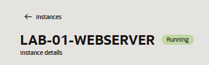
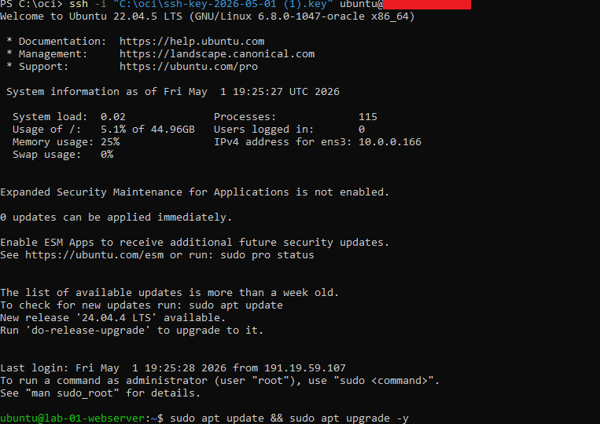
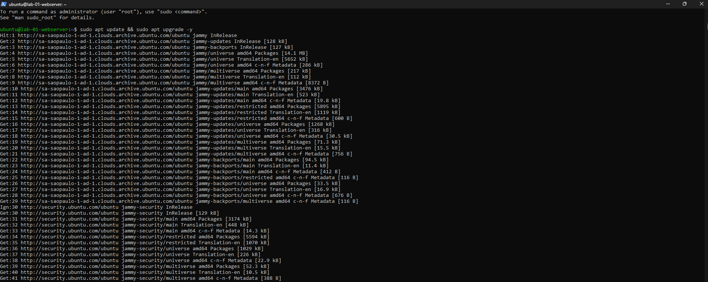
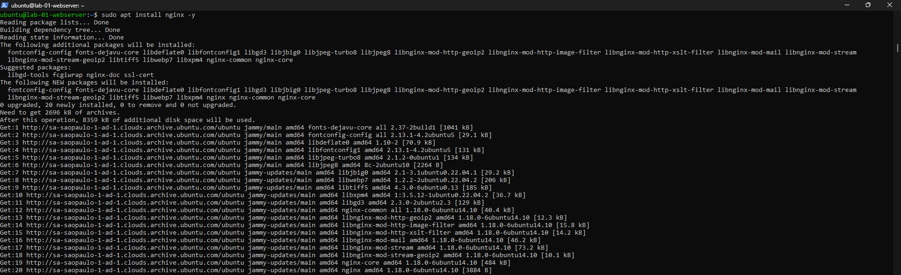
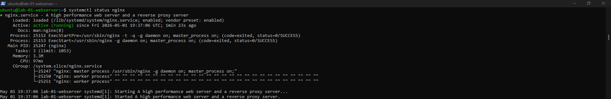
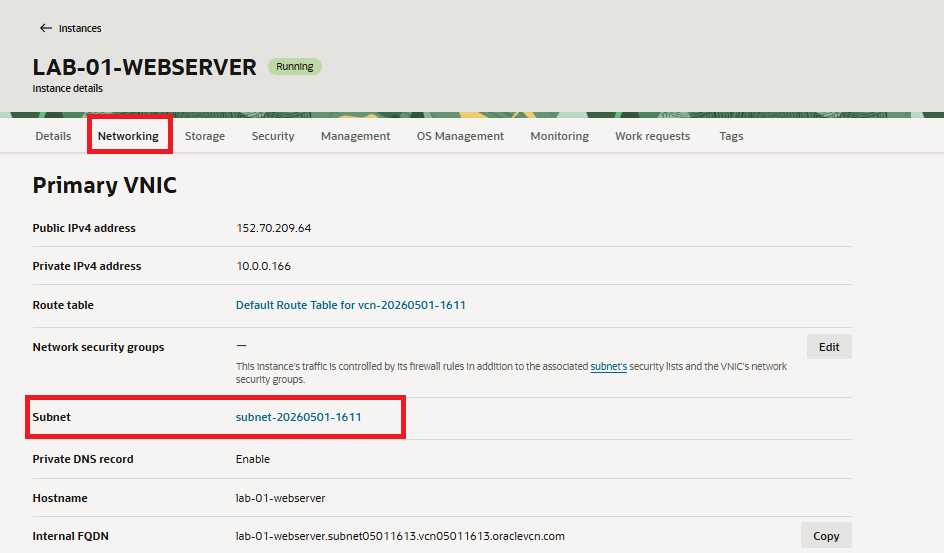
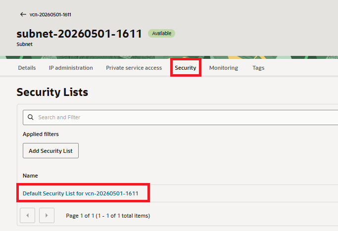
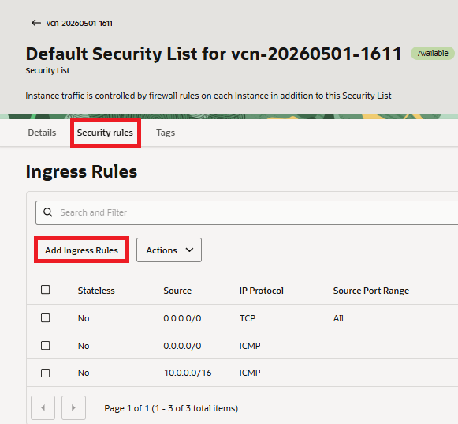
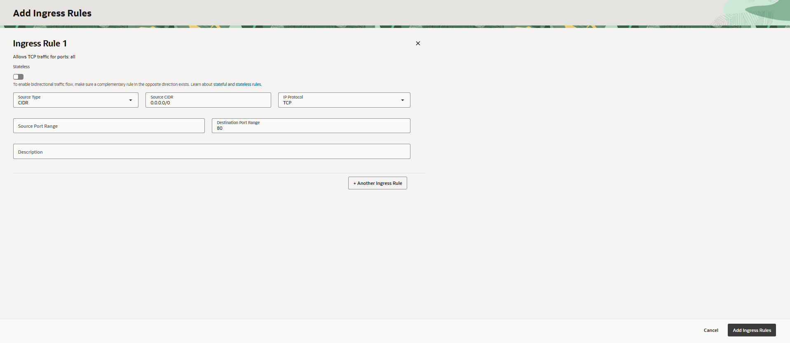
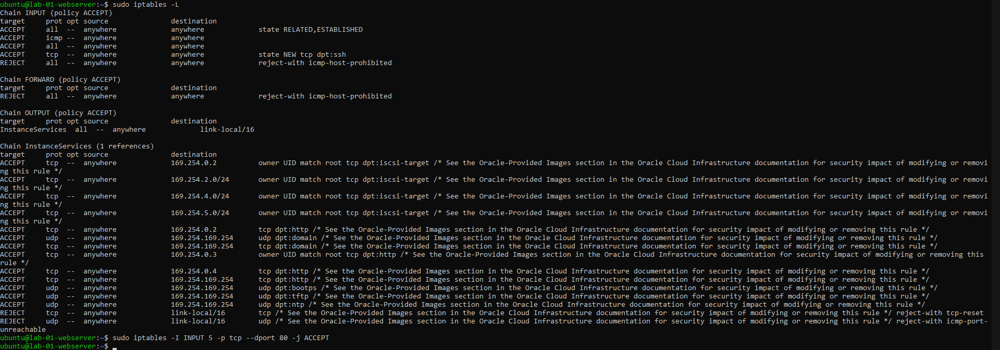

# 🧪 Lab 01 - Web Server Deployment (Linux + Cloud)

## 🎯 Objective

Deploy and configure a web server using Linux in a cloud environment, simulating a real-world infrastructure scenario with networking, firewall configuration, troubleshooting, and service validation.

---

# ☁️ Environment

| Resource | Details |
|---|---|
| Cloud Provider | Oracle Cloud Infrastructure (OCI) |
| Operating System | Ubuntu Server 22.04 LTS |
| Instance Type | VM.Standard.E2.1.Micro |
| Web Server | Nginx |
| Network Type | Public Subnet |
| Access Method | SSH |

---

# 🛠️ Technologies Used

* Linux (Ubuntu)
* Nginx
* SSH
* OCI Networking
* Security Lists
* iptables
* Cloud concepts

---

# ⚙️ Step-by-Step Implementation

---

## 🔹 1. Create the Virtual Machine

Created an Ubuntu virtual machine in Oracle Cloud Infrastructure.

### VM Configuration

| Setting | Value |
|---|---|
| Name | lab-01-webserver |
| Image | Canonical Ubuntu 22.04 |
| Shape | VM.Standard.E2.1.Micro |
| Public IP | Enabled |
| Subnet | Public Subnet |

---

# 📸 Evidence



---

## 🔹 2. Connect via SSH

SSH access was performed using the generated private key.

### SSH Command

```bash
ssh -i key.pem ubuntu@YOUR_PUBLIC_IP
```

---

# 📸 Evidence



---

## 🔹 3. Update the System

Updated package repositories and installed updates.

```bash
sudo apt update -y
```

---

# 📸 Evidence



---

## 🔹 4. Install Nginx

Installed the Nginx web server.

```bash
sudo apt install nginx -y
```

---

# 📸 Evidence



---

## 🔹 5. Status Nginx

Started and validated the Nginx service.

```bash
sudo systemctl start nginx
sudo systemctl enable nginx
sudo systemctl status nginx
```

---

# 📸 Evidence



---

## 🔹 6. Configure Security List

Configured the OCI Security List to allow HTTP traffic.

### Security Configuration

| Setting | Value |
|---|---|
| Source CIDR | 0.0.0.0/0 |
| Protocol | TCP |
| Destination Port | 80 |

---

# 📸 Evidence





---

## 🔹 7. Add Ingress Rule

Added an ingress rule to allow inbound HTTP traffic on port 80.

---

# 📸 Evidence





---

## 🔹 8. Validate Listening Ports

Validated that Nginx was listening on TCP port 80.

```bash
sudo ss -tulnp | grep 80
```

Expected result:

```text
0.0.0.0:80
```

---

## 🔹 9. Inspect iptables Rules

Checked local Linux firewall rules.

```bash
sudo iptables -L
```

A restrictive INPUT rule was blocking HTTP traffic.

---

# 📸 Evidence



---

## 🔹 10. Allow HTTP Traffic

Allowed inbound traffic on port 80.

```bash
sudo iptables -I INPUT 5 -p tcp --dport 80 -j ACCEPT
```

---

## 🔹 11. Verify Access via Browser

Open your browser and access:

```text
http://YOUR_PUBLIC_IP
```

Expected result:

👉 Nginx default page ("Welcome to nginx")

---

# 🧠 Skills Practiced

* Linux Administration
* Cloud Infrastructure
* SSH Authentication
* OCI Networking
* Security Lists
* Firewall Troubleshooting
* iptables Management
* Nginx Deployment
* Infrastructure Troubleshooting

---

# 🌍 Real World Scenario

This lab simulates a basic cloud-hosted web server deployment commonly used for:

* Internal company systems
* Small web applications
* Linux server administration practice
* Cloud infrastructure learning
* Initial DevOps environments

---

# 🎯 Learning Outcome

This lab provided hands-on experience with:
- Cloud virtual machine deployment
- Linux server configuration
- Networking validation
- Firewall troubleshooting
- Web server deployment
- Real-world infrastructure debugging
